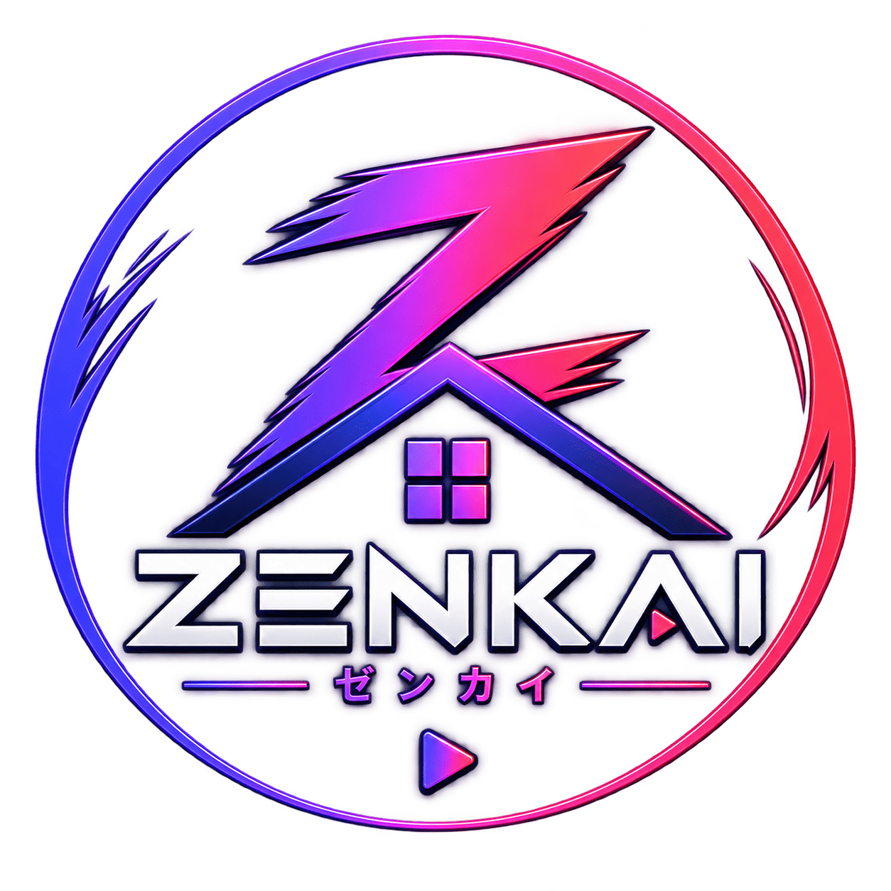
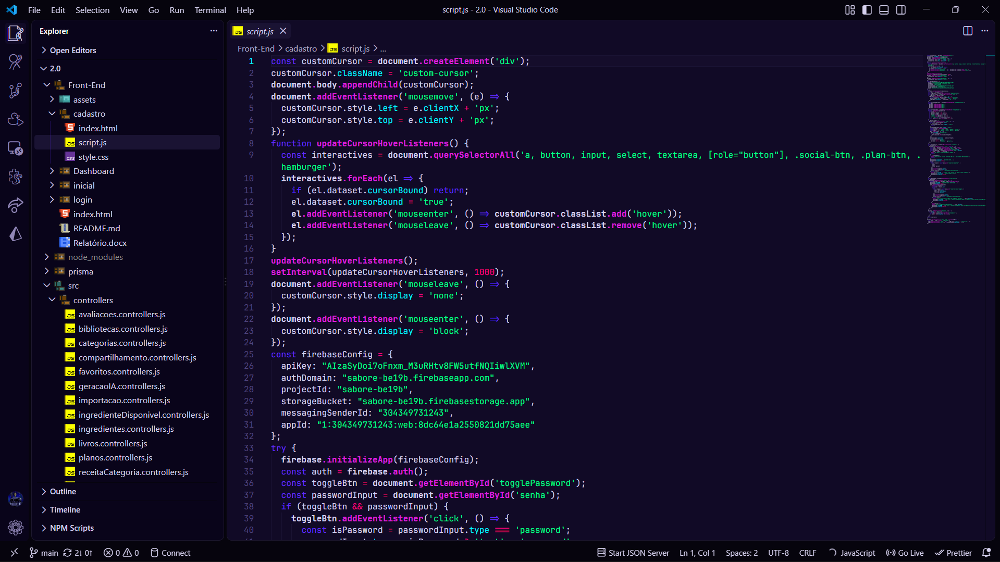
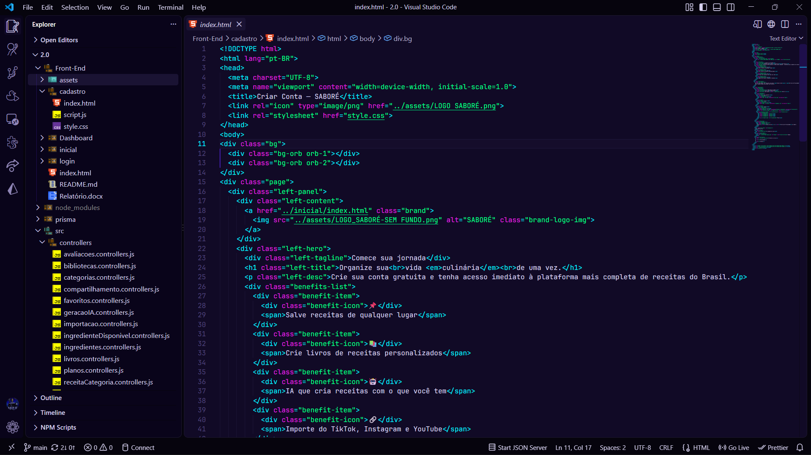
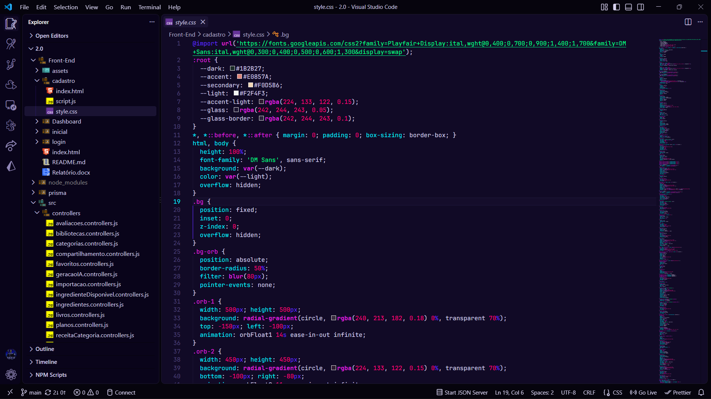

<div align="center">
  
  <h1>Zenkai Theme</h1>
  <p><b>A vibrant, neon-infused dark theme ecosystem for Visual Studio Code inspired by the Zenkai Universe.</b></p>

  <p>
    <a href="https://zenkai-streaming.vercel.app/index.html"></a>
    <a href="https://marketplace.visualstudio.com/items?itemName=zenkai.zenkai-vscode-extension"></a>
    
  </p>
</div>

---

## About Zenkai ^_^

[**Zenkai**](https://zenkai-streaming.vercel.app/index.html) is a complete ecosystem uniting **Animes, Cartoons, Movies, Mangas, Comics (HQs), Games, and Artificial Intelligence (ZenkAI)** into a single immersive experience.

This official VS Code extension brings the vibrant cyberpunk and neon aesthetic of the Zenkai platform directly into your code editor. Designed for developers, creators, and marathon coders who want high contrast, reduced eye strain, and a futuristic visual environment.

### Theme Preview

<div align="center">

## JavaScript
  

## HTML
  

## CSS
  
</div>

---

## The Themes

The Zenkai VS Code Extension now features **11 stunning Neon color variants**, all built on top of our signature ultra-deep dark background. 

### Standard Neon Collection
Each theme in the Standard Collection uses a specific primary neon accent color for borders, selections, and cursors, paired with harmonious secondary colors for syntax highlighting:

- **Zenkai Neon Cyan** (`#72FFFF`) - Crisp and futuristic.
- **Zenkai Neon Green** (`#00FF00`) - The classic hacker matrix vibe.
- **Zenkai Neon Yellow** (`#F5E200`) - High energy and alert.
- **Zenkai Neon Red** (`#FF0000`) - Aggressive, bold, and intense.
- **Zenkai Neon Purple** (`#A000FF`) - Deep cyberpunk aesthetics.
- **Zenkai Neon Orange** (`#FF7A20`) - Warm, fiery, and dynamic.
- **Zenkai Neon Blue** (`#2979FF`) - Cool, calm, and focused.
- **Zenkai Neon Dark Green** (`#1F6E52`) - Subdued neon forest tones.
- **Zenkai Neon White** (`#FFFFFF`) - Pure contrast and minimalism.
- **Zenkai Neon Aqua** (`#3FF2A0`) - Refreshing tropical cyber-vibes.

*(Note: The legacy "Zenkai Dark" theme is still available for backwards compatibility.)*

### ✨ Special Theme: Stellar Abyss ✨

Designed to make you feel like you're floating in the vacuum of space.
- **Primary Accent**: Stellar Blue (`#A6CCFF`)
- **Background**: True near-black space tones.
- **Vibe**: Nebula purples, starlight whites, and cool cosmic blues. It offers a cooler, more ethereal palette compared to the aggressive neon of the standard collection.

---

## Installation

### From VS Code Marketplace and IDE's Open VSX Registry

1. Open **VS Code** and go to **Extensions** (`Ctrl+Shift+X` or `Cmd+Shift+X`).
2. Search for **`Zenkai Theme`**.
3. Click **Install**.
4. Go to **File > Preferences > Color Theme** and select your favorite Zenkai theme from the list (e.g., **Zenkai Stellar Abyss**).

### Official Marketplace Links

You can view and install the extension directly from your favorite marketplace:

- [**VS Code Marketplace**](https://marketplace.visualstudio.com/items?itemName=Zenkai.zenkai-vscode-extension)
- [**Open VSX Registry**](https://open-vsx.org/extension/zenkai/zenkai-vscode-extension) (For Antigravity IDE, VSCodium, Cursor, and other open-source editors)

### Manual VSIX Installation

If you downloaded the `.vsix` file directly, you can install it using:
```bash
code --install-extension zenkai.zenkai-vscode-extension
```

---

## Explore the Zenkai Universe

Check out the official portals on the Zenkai Platform:

- [**Animes**](https://zenkai-streaming.vercel.app/animes) — Action, fantasy, and classics.
- [**Desenhos**](https://zenkai-streaming.vercel.app/desenhos) — Warner, Cartoon Network & Disney nostalgic lineup.
- [**Filmes**](https://zenkai-streaming.vercel.app/filmes) — Cinema sessions for every mood.
- [**ZenkAI**](https://zenkai-streaming.vercel.app/zenkai) — AI assistant for image analysis and character comparisons.
- [**Mangás & HQs**](https://zenkai-streaming.vercel.app/mangas) — Organized chapters and comic sagas.
- [**SenseiMod Store & Games**](https://zenkai-streaming.vercel.app/loja) — Quests, rewards, and customization.

---

<div align="center">
  <p>Made by the <b>Zenkai Team <3</b></p>
  <p>© 2026 Zenkai · Animes, Movies, Cartoons, Mangas, HQs and Artificial Intelligence</p>
  <p>
    <a href="https://github.com/ViselBrx"></a>
  </p>
</div>

### Enjoy! ❤️